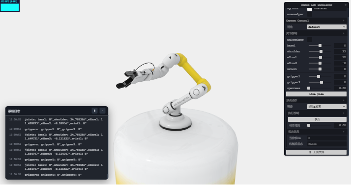

# 机械臂仿真 Demo

基于 Three.js + TypeScript 的机械臂仿真项目，用于demo展示与学习机器人仿真相关知识。



## 技术栈

- **前端**: Three.js + TypeScript
- **UI控制**: Tweakpane
- **动画**: GSAP
- **性能监控**: Stats.js + WebGLInfo (`renderer.info`)
- **模型**: Blender + [Sketchfab](https://skfb.ly/oOSqr)

## 功能特性

- ✅ 基础项目架构搭建
- ✅ Three.js 场景初始化
- ✅ 机械臂模型加载
- ✅ 控制面板 UI
- ✅ 性能监控面板
- ✅ 关节运动控制
- ✅ 视角切换
- ✅ 动作预设库
- ✅ 文件上传
- ✅ 轨迹可视化
- ✅ WebSocket 实时通信
- 🔄 ~~动作录制与回放~~
- 🔄 ~~物理仿真（任务场景、碰撞检测）~~

## ✅ run

```bash
npm install

npm run dev

# 启动WebSocket服务
npm run server
```

## buy me a coffee

创作不易，多多支持~  
你的支持是我创作的最大动力！


